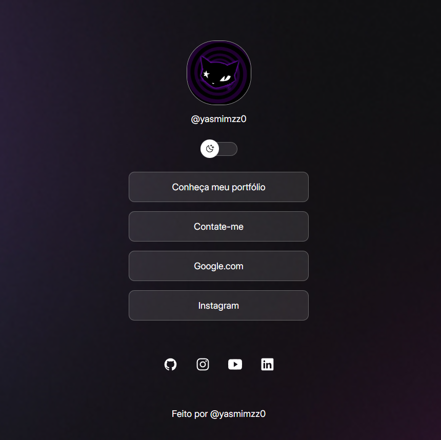

# 🌐 Página de Links - estilo Linktree

Este projeto é uma página web responsiva que centraliza todos os seus principais links em um só lugar — inspirado no Linktree. Ideal para usar na bio do Instagram, Twitter, portfólio ou qualquer lugar onde você deseje compartilhar seus links rapidamente.

## 📸 Preview

 <!-- Substitua pelo caminho da imagem se tiver uma -->

## 🔗 Acesse

Você pode ver o projeto publicado aqui:  
[https://https://github.com/YasmimMatosLi/link-hub](https://github.com/YasmimMatosLi/link-hub)

## 🚀 Funcionalidades

- Layout simples e direto
- Totalmente responsivo (funciona bem em celulares e desktops)
- Ícones personalizados para cada link
- Fácil de editar e adaptar com seus próprios links

## 🛠️ Tecnologias Utilizadas

- HTML5
- CSS3
- JavaScript
- Google Fonts ou Font Awesome

